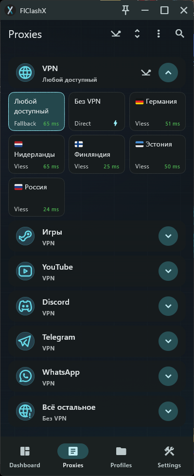
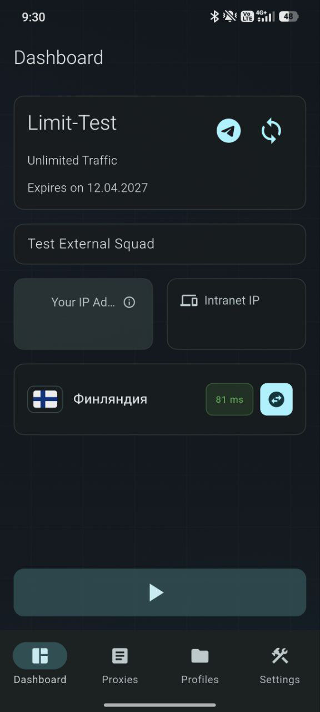

# FlClashX: Remnawave subscription page theme 

Theme for **[FlClashX](https://github.com/pluralplay/FlClashX)**  
Inspired by **[Remnawave](https://github.com/remnawave)** subscription page

examples
WIN/ANDROID

<p>
  
  
  
  
</p>
## Headers example

```yaml
flclashx-widgets: metainfo,announce,networkDetection,intranetIp,changeServerButton
flclashx-hex: 66d9e8:content
flclashx-background: link to background.png
